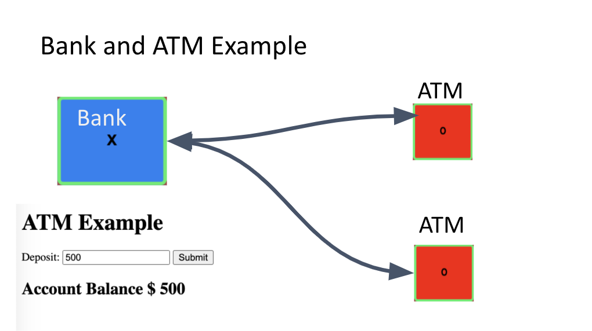

# ATM-machine-activity
ATM activity for MITxPro Coding certificate 

In this exercise, we learn how to keep track of the state of an automated teller machine or ATM. An ATM is a machine that you can use to withdraw or deposit cash to your bank account. 

We create a simple ATM with two components (the bank and the ATM) and learn how to synchronize them so that the account balance updates when cash is deposited or withdrawn.
We adding validation so users can’t withdraw more money than the account balance and modify the user interface to require users to select deposit or withdraw before an input field is visible

	
## Technologies
Project is created with:
* React hook
* JavaScript
	
## Setup
To run this project download the files locally into the same directory. Open a command line on your computer and run the command cd path/to/project/root, which allows you to point to the root folder of the starter files (note that path/to/project/root should be replaced with the actual path to the starter files)
Within the same command-line window, run npm install to install all dependencies
Once the command completes successfully, run npm start to start the application in your browser.

## Roadmap
Next improvements may include more visual complexity (color, shappe, text) and functionality to the form.

## License
This project is open source and available under the [MIT License](LICENSE).

